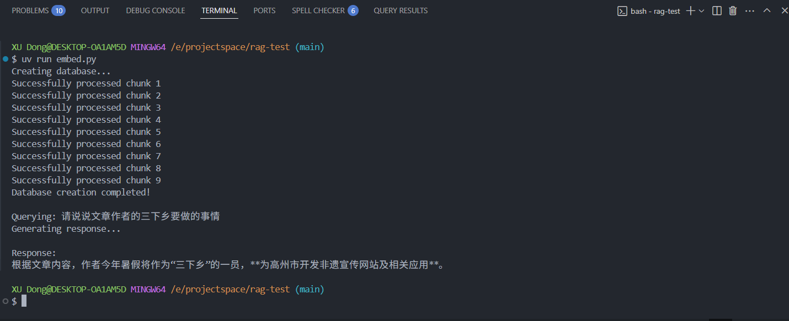

# RAG Test

P.S. `embed.py` use `time.sleep()` to avoid hitting the Google API rate limit, which makes the script run slower.
you can adjust the sleep time according to your needs.

## Overview

This project demonstrates a simple Retrieval-Augmented Generation (RAG) system using a text embedding model. It includes functionality to embed text, store embeddings in a database, and query the database for relevant chunks based on a question.



## Getting Started

To get started with this project, you need to set up your environment and install the required dependencies. Follow the steps below:

### Clone the repository:

```bash
git clone https://github.com/xudong7/rag-test.git
cd rag-test
```

### Use uv to install the required dependencies:

```bash
uv sync
```

### Set up the environment variables:

create the `.env` file and configure the following variables:

```bash
# .env
GOOGLE_API_KEY=xxxxxxxxxxxxxxxxxxxxxxxxxxxxx
```

### Run the embedding script to process your text data:

```bash
uv run embed.py
```

P.S. you can replace `data.md` with your own text file and change question in `embed.py` to test with different queries.

## Usage

Just for test purposes, the `embed.py` script will:

1. Load the text data from `data.md`.
2. Split the text into chunks and embed each chunk using the text embedding model.
3. Store the embeddings in the database.
4. Allow you to query the database with a question and retrieve relevant chunks.

also, you can write your own `chunk` function to customize how the text is split into chunks.
